Example of scater package for QC
================================

Detailed tutorial of scater package at: <https://www.bioconductor.org/packages/release/bioc/vignettes/scater/inst/doc/vignette.html>

We recommend that you follow steps 3-5 in the tutorial.

Many other packages builds on the SingleCellExperiment class in scater, so it is important that you learn properly how to create an SCESet from your data and understand the basics of the scater package.

For this exercise you can either run with your own data or with the example data that they provide with the package. Below is an example with human innate lympoid cells (ILCs) from Bjorklund et al. 2016.

If you want to run the package with the ILCs, all data can be found at:

`/proj/b2013006/nobackup/scrnaseq_course/data/ILC`

### Load packages

``` r
suppressMessages(library(scater))
```

### Read data and create a scater SCESet

``` r
# read in meta data table and create pheno data
M <- read.table("data/ILC/Metadata_ILC.csv", sep=",",header=T)
# create and AnnotatedDataFrame - class from Biobase
pd <- new("AnnotatedDataFrame",data=M)
rownames(pd)<-M$Samples

# read rpkm values and counts
R <- read.table("data/ILC/ensembl_rpkmvalues_ILC.csv",sep=",",header=T)
C <- read.table("data/ILC/ensembl_countvalues_ILC.csv",sep=",",header=T)
```

Create the SCESet
-----------------

``` r
example_sceset <- newSCESet(countData=C, phenoData = pd, logExprsOffset = 1, )

# you can also add in expression values from the rpkm matrix instead of using logged counts.
set_exprs(example_sceset,"exprs") <- log2(as.matrix(R)+1)

# you can access the rpkm or count matrix with the commands "counts" and "exprs"
counts(example_sceset)[10:13,1:5]
```

    ##                 T74_P1_A9_ILC1 T74_P1_B4_NK T74_P1_B7_ILC2 T74_P1_B9_NK
    ## ENSG00000001167              0            0              0            0
    ## ENSG00000001460              0            0              0            0
    ## ENSG00000001461              0         1035              1            1
    ## ENSG00000001497              0            0              0            0
    ##                 T74_P1_D10_ILC2
    ## ENSG00000001167               0
    ## ENSG00000001460               0
    ## ENSG00000001461               2
    ## ENSG00000001497               0

``` r
exprs(example_sceset)[10:13,1:5]
```

    ##                 T74_P1_A9_ILC1 T74_P1_B4_NK T74_P1_B7_ILC2 T74_P1_B9_NK
    ## ENSG00000001167              0     0.000000      0.0000000    0.0000000
    ## ENSG00000001460              0     0.000000      0.0000000    0.0000000
    ## ENSG00000001461              0     6.615791      0.2243554    0.2142426
    ## ENSG00000001497              0     0.000000      0.0000000    0.0000000
    ##                 T74_P1_D10_ILC2
    ## ENSG00000001167       0.0000000
    ## ENSG00000001460       0.0000000
    ## ENSG00000001461       0.8229705
    ## ENSG00000001497       0.0000000

An SCESet can contain expression values in many different formats, slots to use for expression are:

-   countData
-   exprsData
-   fpkmData
-   tpmData
-   cpmData

The closest to rpkms is in this case fpkms, so we use fpkmData.

It also has slots for:

-   phenoData, an AnnotatedDataFrame object, where rows are cells, and columns are cell attributes (such as cell type, culture condition, day captured, etc.)
-   featureData, an AnnotatedDataFrame object, where rows are features (e.g. genes), and columns are feature attributes, such as biotype, gc content, etc.

And much more that you can read up on with `?newSCESet`

QC stats
--------

Use scater package to calculate qc-metrics

``` r
# first check which genes are spike-ins if you have included those
ercc <- grep("ERCC_",rownames(R))

# specify the ercc as feature control genes and calculate all qc-metrics
example_sceset <- calculateQCMetrics(example_sceset, feature_controls = ercc)

# check what all entries are
varLabels(example_sceset)
```

    ##  [1] "Samples"                                       
    ##  [2] "Plate"                                         
    ##  [3] "Donor"                                         
    ##  [4] "Celltype"                                      
    ##  [5] "total_counts"                                  
    ##  [6] "log10_total_counts"                            
    ##  [7] "filter_on_total_counts"                        
    ##  [8] "total_features"                                
    ##  [9] "log10_total_features"                          
    ## [10] "filter_on_total_features"                      
    ## [11] "pct_dropout"                                   
    ## [12] "exprs_feature_controls_unnamed1"               
    ## [13] "pct_exprs_feature_controls_unnamed1"           
    ## [14] "filter_on_pct_exprs_feature_controls_unnamed1" 
    ## [15] "counts_feature_controls_unnamed1"              
    ## [16] "pct_counts_feature_controls_unnamed1"          
    ## [17] "filter_on_pct_counts_feature_controls_unnamed1"
    ## [18] "n_detected_feature_controls_unnamed1"          
    ## [19] "n_detected_feature_controls"                   
    ## [20] "counts_feature_controls"                       
    ## [21] "pct_counts_feature_controls"                   
    ## [22] "filter_on_pct_counts_feature_controls"         
    ## [23] "pct_counts_top_50_features"                    
    ## [24] "pct_counts_top_100_features"                   
    ## [25] "pct_counts_top_200_features"                   
    ## [26] "pct_counts_top_500_features"                   
    ## [27] "pct_counts_top_50_endogenous_features"         
    ## [28] "pct_counts_top_100_endogenous_features"        
    ## [29] "pct_counts_top_200_endogenous_features"        
    ## [30] "pct_counts_top_500_endogenous_features"        
    ## [31] "counts_endogenous_features"                    
    ## [32] "log10_counts_feature_controls_unnamed1"        
    ## [33] "log10_counts_feature_controls"                 
    ## [34] "log10_counts_endogenous_features"              
    ## [35] "is_cell_control"

A more detailed description can be found at the tutorial site, or by running: `?calculateQCMetrics`

If you have additional qc-metrics that you want to include, like mapping stats, rseqc data etc, you can include all of that in your phenoData.

Look at data interactively in GUI
---------------------------------

You can play around with the data interactively with the shiny app they provide. OBS! It takes a while to load and plot, so be patient.

``` r
# you can open the interactive gui with:
scater_gui(example_sce)
```

Plots of expression values
--------------------------

Different ways of visualizing gene expression per batch/celltype etc.

``` r
# plot detected genes at different library depth for different plates and celltypes
plot(example_sceset, block1 = "Plate", block2 = "Celltype",
     colour_by = "Celltype", nfeatures = 300, exprs_values = "exprs")
```


``` r
# violin plot for gene expression
plotExpression(example_sceset, rownames(example_sceset)[6:11],
               x = "Celltype", exprs_values = "exprs", colour = "Donor",log=TRUE)
```


``` r
plotExpression(example_sceset, rownames(example_sceset)[6:11],
               x = "Celltype", exprs_values = "counts", colour = "Donor",
               show_median = TRUE, show_violin = FALSE,  log = TRUE)
```


You can play around with all the arguments in plotExpression, for example:

-   log=TRUE/FALSE
-   show\_violin=TRUE/FALSE
-   show\_median=TRUE/FALSE
-   exprs\_values="counts"/"exprs"

And specify different coloring and and batches to plot by that are defined in the phenoData.

QC overview and filtering
-------------------------

There are several ways to plot the QC summaries of the cells in the scater package. A few examples are provided below. In this case, cells have already been filtered to remove low quality samples, so no filtering step is performed.

``` r
# first remove all features with no/low expression, here set to expression in more than 5 cells with > 1 count
keep_feature <- rowSums(counts(example_sceset) > 1) > 5
example_sceset <- example_sceset[keep_feature,]

## Plot highest expressed genes.
plotQC(example_sceset, type = "highest-expression", exprs_values = "exprs",col_by="Celltype")
```

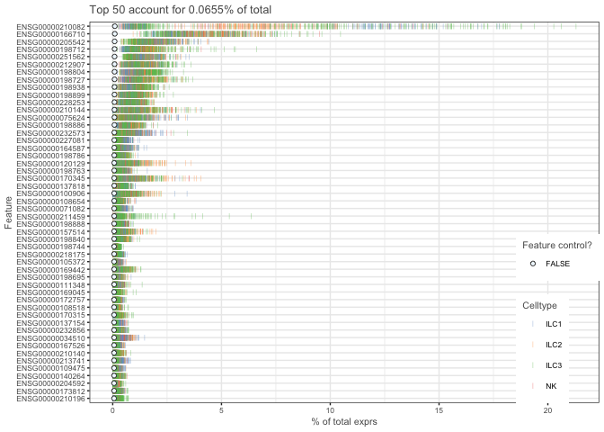

Plot frequency of expxression (number of cells with detection) vs mean expression.

``` r
plotQC(example_sceset, type = "exprs-freq-vs-mean")
```

    ## `geom_smooth()` using method = 'loess'

    ## Warning in f(...): The default behavior of beeswarm has changed in version
    ## 0.6.0. In versions <0.6.0, this plot would have been dodged on the y-
    ## axis. In versions >=0.6.0, grouponX=FALSE must be explicitly set to group
    ## on y-axis. Please set grouponX=TRUE/FALSE to avoid this warning and ensure
    ## proper axis choice.

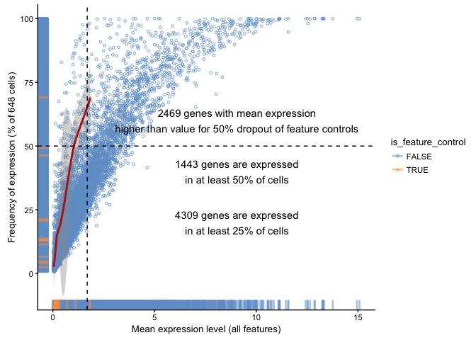

Plot percent of counts vs number of cells a gene is detected in.

``` r
plotFeatureData(example_sceset, aes(x = n_cells_exprs, y = pct_total_counts))
```

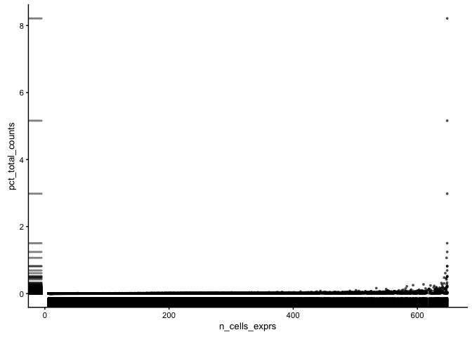

Plot different qc-metrics per batch.

``` r
p1 <- plotPhenoData(example_sceset, aes(x = Donor, y = total_features,                                  colour = log10_total_counts))

p2 <- plotPhenoData(example_sceset, aes(x = Celltype, y = total_features,                                  colour = log10_total_counts))

multiplot(p1, p2, rows = 2)
```

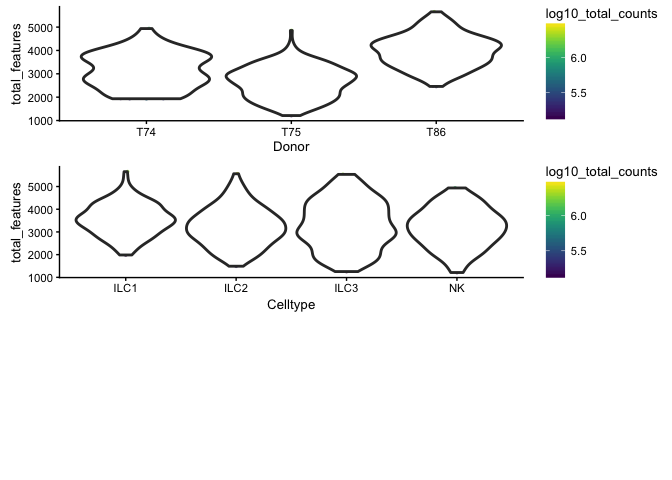

    ## [1] 2

Plot the percentage of expression accounted for by feature controls against total\_features.

``` r
plotPhenoData(example_sceset, 
      aes(x = total_features, y = pct_counts_feature_controls, colour = Donor)) + 
      theme(legend.position = "top") +
      stat_smooth(method = "lm", se = FALSE, size = 2, fullrange = TRUE)
```

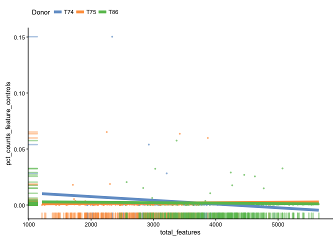

Dimensionality reduction plots
------------------------------

Plot the cells in reduced space and define color/shape/size by different qc-metrics or meta-data entries.

``` r
# PCA - with different coloring by celltype and donor, first 4 components
plotPCA(example_sceset,ncomponents=4,colour_by="Celltype",shape_by="Donor")
```

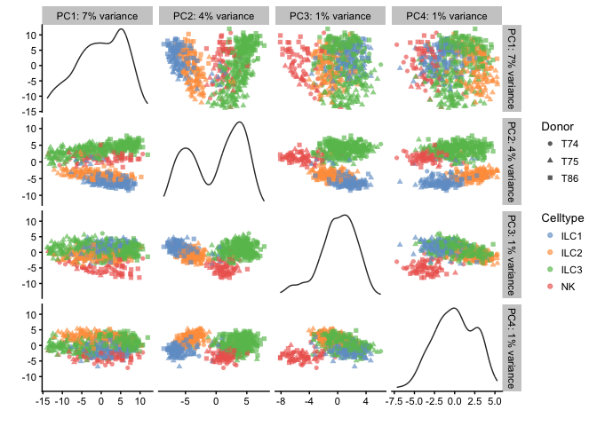

``` r
plotPCA(example_sceset,ncomponents=4,colour_by="Donor",shape_by="Celltype")
```

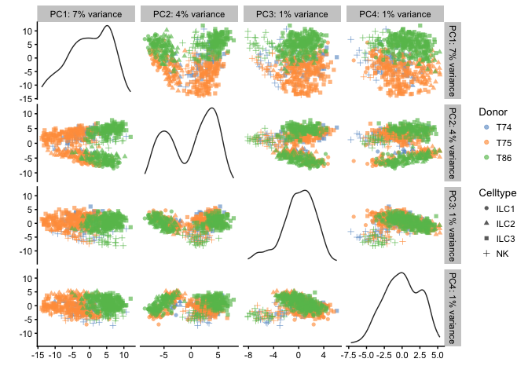

``` r
# Diffusion map 
plotDiffusionMap(example_sceset, colour_by="Celltype",shape_by="Donor",ncomponents=4)
```

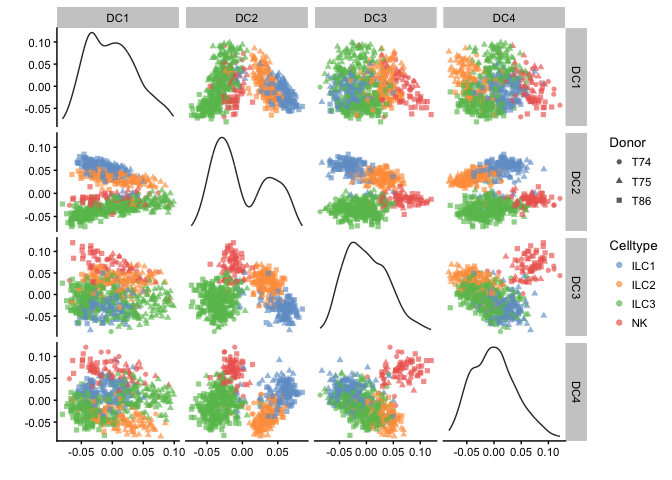

``` r
# tSNE - uses Rtsne function to run tsne
plotTSNE(example_sceset, colour_by="Celltype",shape_by="Donor", ntop=30, perplexity=30 )
```

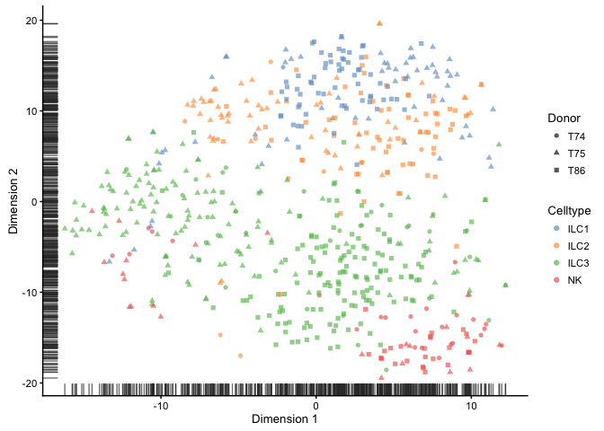

For all of these dimensionality reduction methods, you can specify `return_SCESet = TRUE` and it will return an SCESet object with the slot reducedDimension filled. This can be usefule if PCA/tSNE takes long time to run and you want to plot several different colors etc.

You can later plot the reduced dimension with `plotReducedDim`.

### PCA based on QC-measures

PCA based on the phenoData can be used to detect outlier cells with qc-measures that deviates from the rest. But be careful with checking how these cells deviate before taking a decision on why to remove them.

OBS! detection of outlier requires that package `mvoutlier` is installed.

``` r
example_sceset <- plotPCA(example_sceset, pca_data_input = "pdata", 
                          detect_outliers = TRUE, return_SCESet = TRUE)
```

    ## sROC 0.1-2 loaded

    ## The following cells/samples are detected as outliers:
    ## T74_P2_C8_ILC3
    ## T74_P2_E12_ILC3
    ## T74_P4_H3_ILC3
    ## T75_P2_A9_ILC3
    ## T75_P4_B1_ILC1
    ## T75_P3_C8_ILC2
    ## T75_P1_D8_ILC3
    ## T75_P3_E10_ILC2
    ## T75_P1_E11_ILC3
    ## T75_P3_E2_ILC2
    ## T75_P3_F10_ILC2
    ## T75_P3_F2_ILC2
    ## T75_P4_F5_ILC1
    ## T75_P1_F8_ILC3
    ## T75_P1_G10_ILC3
    ## T75_P3_H2_ILC2
    ## T75_P1_H8_ILC3
    ## T75_P4_H9_ILC1
    ## T86_P1_B1_ILC3
    ## T86_P1_F10_ILC3
    ## T86_P1_F9_ILC3
    ## T86_P2_A12_ILC2
    ## T86_P2_A8_ILC2
    ## T86_P2_B3_ILC2
    ## T86_P2_C11_ILC2
    ## T86_P2_C5_ILC2
    ## T86_P2_E3_ILC2
    ## T86_P3_E9_ILC1
    ## T86_P3_H11_ILC1
    ## T86_P4_B1_ILC3
    ## T86_P4_C8_ILC3
    ## T86_P4_D7_ILC3
    ## T86_P4_E7_NK
    ## T86_P4_H10_ILC3
    ## Variables with highest loadings for PC1 and PC2:
    ## 
    ##                                            PC1          PC2
    ## ---------------------------------  -----------  -----------
    ## log10_counts_endogenous_features     0.5052670   -0.2163332
    ## n_detected_feature_controls          0.4814972    0.1301703
    ## log10_counts_feature_controls        0.4782643    0.4399778
    ## total_features                       0.4567161   -0.3759012
    ## pct_counts_feature_controls          0.1727410    0.6207904
    ## pct_counts_top_100_features         -0.2137752    0.4647503

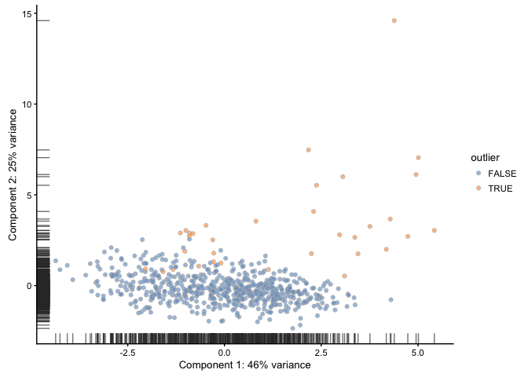

``` r
# we can use the filter function to remove all outlier cells
filtered_sceset <- filter(example_sceset, outlier==FALSE)
```

QC of experimental variables
----------------------------

Median marginal R2 for each variable in pData(example\_sceset) when fitting a linear model regressing exprs values against just that variable. Shows how much of the data variation is explained by a single variable.

``` r
plotQC(example_sceset, type = "expl")
```

    ## The variable filter_on_total_counts only has one unique value, so R^2 is not meaningful.
    ## This variable will not be plotted.

    ## The variable filter_on_total_features only has one unique value, so R^2 is not meaningful.
    ## This variable will not be plotted.

    ## The variable filter_on_pct_exprs_feature_controls_unnamed1 only has one unique value, so R^2 is not meaningful.
    ## This variable will not be plotted.

    ## The variable filter_on_pct_counts_feature_controls_unnamed1 only has one unique value, so R^2 is not meaningful.
    ## This variable will not be plotted.

    ## The variable filter_on_pct_counts_feature_controls only has one unique value, so R^2 is not meaningful.
    ## This variable will not be plotted.

    ## The variable is_cell_control only has one unique value, so R^2 is not meaningful.
    ## This variable will not be plotted.

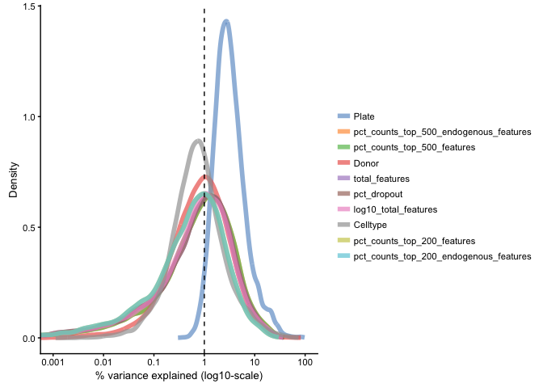

Identify PCs that correlate strongly to certain QC or Meta-data values

``` r
# for total_features
plotQC(example_sceset, type = "find-pcs", variable = "total_features", plot_type = "pairs-pcs")
```

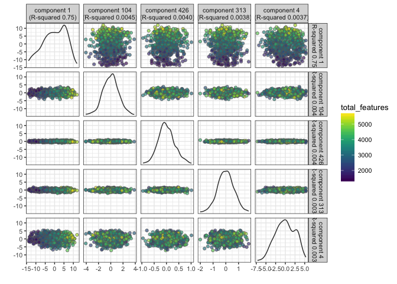

``` r
# for Donor
plotQC(example_sceset, type = "find-pcs", variable = "Donor", plot_type = "pairs-pcs")
```

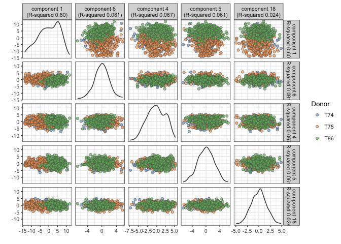

PC1 clearly correlates to total\_features, which is a common problem in scRNAseq data. This may be a technical artifact, or a biological features of celltypes with very different sizes.

It is also clear that PC1 separates out the different donors.

\`\`\`
