Analysis of data using Seurat package, following tutorial at: <http://satijalab.org/seurat/pbmc3k_tutorial.html>

We recommend that you follow steps XX in the tutorial.

Seurat has specific functions for loading and working with drop-seq data. Please use the provided dataset for PBMCs that comes with the tutorial. But you can also run with your own data or with the example data, but keep in mind that may functions assume that the count data is UMIs. Below is an example with human innate lympoid cells (ILCs) from Bjorklund et al. 2016.

### Load packages

``` r
suppressMessages(require(Seurat))
suppressMessages(require(gridExtra))
```

### Load expression values and metadata

``` r
R <- read.table("data/ILC/ensembl_rpkmvalues_ILC.csv",sep=",",header=T,row.names=1)
M <- read.table("data/ILC/Metadata_ILC.csv",sep=",",header=T,row.names=1)

# in this case it may be wise to translate ensembl IDs to gene names to make plots with genes more understandable
TR <- read.table("data/ILC/gene_name_translation_biotype.tab",sep="\t")

# find the correct entries in TR and merge ensembl name and gene id.
m <- match(rownames(R),TR$ensembl_gene_id)
newnames <- apply(cbind(as.vector(TR$external_gene_name)[m],rownames(R)),1,paste,collapse=":")
rownames(R)<-newnames

# check which genes are spike-ins in the matrix
spikes <- grepl("ERCC_",rownames(D))

celltype2cols <- c("blue", "cyan", "red", "green")[as.integer(M$Celltype)]
donor2cols <- c("black", "orange", "magenta")[as.integer(M$Donor)]
```

### Create seurat object

Will automatically filter out genes/cells that do not meet the criteria specified so save space.

``` r
data <- CreateSeuratObject(raw.data = R, min.cells = 3, min.genes = 200, 
    project = "ILC",is.expr=1,meta.data=M)

# plot number of genes and nUMI (rpkms in this case) for each Donor
VlnPlot(object = data, features.plot = c("nGene", "nUMI"), nCol = 2)
```

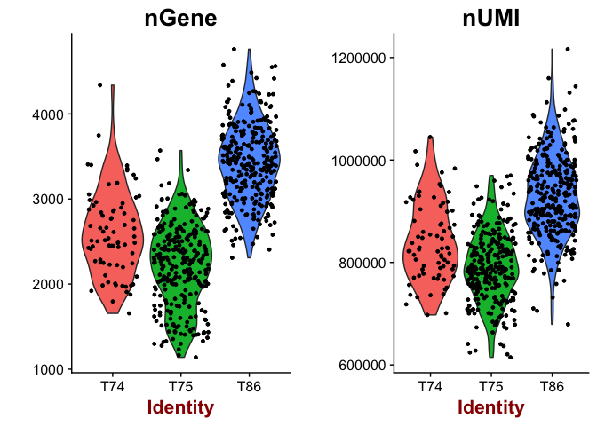

``` r
# same for celltype
VlnPlot(object = data, features.plot = c("nGene", "nUMI"), nCol = 2,group.by="Celltype")
```

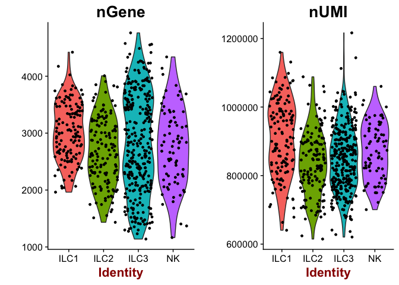

``` r
# scatterplot with detected genes vs UMIs
GenePlot(object = data, gene1 = "nUMI", gene2 = "nGene")
```

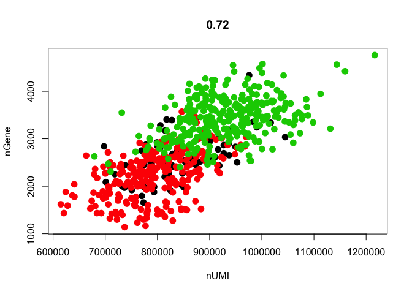

``` r
# the slot data@ident defines the classes of cells, which is automatically set to plate id, To instead plot by celltype, data@ident needs to be changed.
data <- SetAllIdent(object = data, id = "Celltype")
GenePlot(object = data, gene1 = "nUMI", gene2 = "nGene")
```

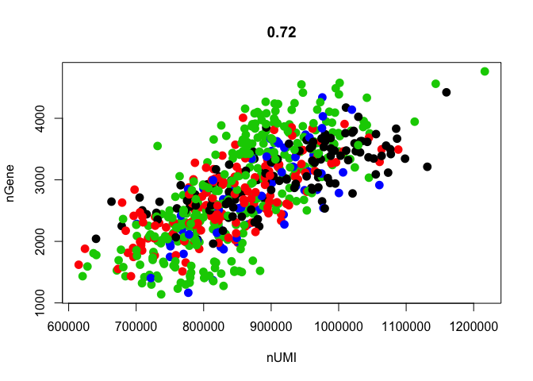

``` r
# change back to Donor
data <- SetAllIdent(object = data, id = "Donor")
```

OBS! Each time you want to change colors in a plot, you need to change the identity class value in the seurat object in the slot <data@ident>.

Data scaling
------------

``` r
# set scale factor according to mean library size
scale.factor <- mean(colSums(R))
data <- NormalizeData(object = data, normalization.method = "LogNormalize", 
    scale.factor = scale.factor)

# look at the plot for suitable cutoffs and rerun
data <- FindVariableGenes(object = data, mean.function = ExpMean, dispersion.function = LogVMR, x.low.cutoff = 0.2, x.high.cutoff = 10, y.cutoff = 0.5)
```

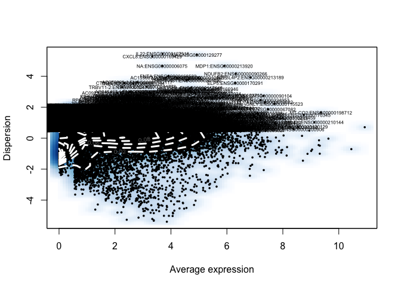

``` r
length(x = data@var.genes)
```

    ## [1] 6559

``` r
# regress out number of detected genes.d
data <- ScaleData(object = data, vars.to.regress = c("nGene"))
```

    ## [1] "Regressing out nGene"
    ## 
      |                                                                       
      |                                                                 |   0%
      |                                                                       
      |=                                                                |   1%
      |                                                                       
      |=                                                                |   2%
      |                                                                       
      |==                                                               |   3%
      |                                                                       
      |===                                                              |   4%
      |                                                                       
      |===                                                              |   5%
      |                                                                       
      |====                                                             |   6%
      |                                                                       
      |====                                                             |   7%
      |                                                                       
      |=====                                                            |   7%
      |                                                                       
      |=====                                                            |   8%
      |                                                                       
      |======                                                           |   9%
      |                                                                       
      |======                                                           |  10%
      |                                                                       
      |=======                                                          |  10%
      |                                                                       
      |=======                                                          |  11%
      |                                                                       
      |========                                                         |  12%
      |                                                                       
      |========                                                         |  13%
      |                                                                       
      |=========                                                        |  13%
      |                                                                       
      |=========                                                        |  14%
      |                                                                       
      |==========                                                       |  15%
      |                                                                       
      |==========                                                       |  16%
      |                                                                       
      |===========                                                      |  17%
      |                                                                       
      |============                                                     |  18%
      |                                                                       
      |============                                                     |  19%
      |                                                                       
      |=============                                                    |  20%
      |                                                                       
      |==============                                                   |  21%
      |                                                                       
      |==============                                                   |  22%
      |                                                                       
      |===============                                                  |  23%
      |                                                                       
      |================                                                 |  24%
      |                                                                       
      |================                                                 |  25%
      |                                                                       
      |=================                                                |  26%
      |                                                                       
      |=================                                                |  27%
      |                                                                       
      |==================                                               |  27%
      |                                                                       
      |==================                                               |  28%
      |                                                                       
      |===================                                              |  29%
      |                                                                       
      |===================                                              |  30%
      |                                                                       
      |====================                                             |  30%
      |                                                                       
      |====================                                             |  31%
      |                                                                       
      |=====================                                            |  32%
      |                                                                       
      |=====================                                            |  33%
      |                                                                       
      |======================                                           |  33%
      |                                                                       
      |======================                                           |  34%
      |                                                                       
      |=======================                                          |  35%
      |                                                                       
      |=======================                                          |  36%
      |                                                                       
      |========================                                         |  37%
      |                                                                       
      |=========================                                        |  38%
      |                                                                       
      |=========================                                        |  39%
      |                                                                       
      |==========================                                       |  40%
      |                                                                       
      |===========================                                      |  41%
      |                                                                       
      |===========================                                      |  42%
      |                                                                       
      |============================                                     |  43%
      |                                                                       
      |=============================                                    |  44%
      |                                                                       
      |=============================                                    |  45%
      |                                                                       
      |==============================                                   |  46%
      |                                                                       
      |==============================                                   |  47%
      |                                                                       
      |===============================                                  |  47%
      |                                                                       
      |===============================                                  |  48%
      |                                                                       
      |================================                                 |  49%
      |                                                                       
      |================================                                 |  50%
      |                                                                       
      |=================================                                |  50%
      |                                                                       
      |=================================                                |  51%
      |                                                                       
      |==================================                               |  52%
      |                                                                       
      |==================================                               |  53%
      |                                                                       
      |===================================                              |  53%
      |                                                                       
      |===================================                              |  54%
      |                                                                       
      |====================================                             |  55%
      |                                                                       
      |====================================                             |  56%
      |                                                                       
      |=====================================                            |  57%
      |                                                                       
      |======================================                           |  58%
      |                                                                       
      |======================================                           |  59%
      |                                                                       
      |=======================================                          |  60%
      |                                                                       
      |========================================                         |  61%
      |                                                                       
      |========================================                         |  62%
      |                                                                       
      |=========================================                        |  63%
      |                                                                       
      |==========================================                       |  64%
      |                                                                       
      |==========================================                       |  65%
      |                                                                       
      |===========================================                      |  66%
      |                                                                       
      |===========================================                      |  67%
      |                                                                       
      |============================================                     |  67%
      |                                                                       
      |============================================                     |  68%
      |                                                                       
      |=============================================                    |  69%
      |                                                                       
      |=============================================                    |  70%
      |                                                                       
      |==============================================                   |  70%
      |                                                                       
      |==============================================                   |  71%
      |                                                                       
      |===============================================                  |  72%
      |                                                                       
      |===============================================                  |  73%
      |                                                                       
      |================================================                 |  73%
      |                                                                       
      |================================================                 |  74%
      |                                                                       
      |=================================================                |  75%
      |                                                                       
      |=================================================                |  76%
      |                                                                       
      |==================================================               |  77%
      |                                                                       
      |===================================================              |  78%
      |                                                                       
      |===================================================              |  79%
      |                                                                       
      |====================================================             |  80%
      |                                                                       
      |=====================================================            |  81%
      |                                                                       
      |=====================================================            |  82%
      |                                                                       
      |======================================================           |  83%
      |                                                                       
      |=======================================================          |  84%
      |                                                                       
      |=======================================================          |  85%
      |                                                                       
      |========================================================         |  86%
      |                                                                       
      |========================================================         |  87%
      |                                                                       
      |=========================================================        |  87%
      |                                                                       
      |=========================================================        |  88%
      |                                                                       
      |==========================================================       |  89%
      |                                                                       
      |==========================================================       |  90%
      |                                                                       
      |===========================================================      |  90%
      |                                                                       
      |===========================================================      |  91%
      |                                                                       
      |============================================================     |  92%
      |                                                                       
      |============================================================     |  93%
      |                                                                       
      |=============================================================    |  93%
      |                                                                       
      |=============================================================    |  94%
      |                                                                       
      |==============================================================   |  95%
      |                                                                       
      |==============================================================   |  96%
      |                                                                       
      |===============================================================  |  97%
      |                                                                       
      |================================================================ |  98%
      |                                                                       
      |================================================================ |  99%
      |                                                                       
      |=================================================================| 100%
    ## [1] "Scaling data matrix"
    ## 
      |                                                                       
      |                                                                 |   0%
      |                                                                       
      |=================================================================| 100%

``` r
# also with batch info
dataB <- ScaleData(object = data, vars.to.regress = c("nGene","Donor"))
```

    ## [1] "Regressing out nGene" "Regressing out Donor"
    ## 
      |                                                                       
      |                                                                 |   0%
      |                                                                       
      |=                                                                |   1%
      |                                                                       
      |=                                                                |   2%
      |                                                                       
      |==                                                               |   3%
      |                                                                       
      |===                                                              |   4%
      |                                                                       
      |===                                                              |   5%
      |                                                                       
      |====                                                             |   6%
      |                                                                       
      |====                                                             |   7%
      |                                                                       
      |=====                                                            |   7%
      |                                                                       
      |=====                                                            |   8%
      |                                                                       
      |======                                                           |   9%
      |                                                                       
      |======                                                           |  10%
      |                                                                       
      |=======                                                          |  10%
      |                                                                       
      |=======                                                          |  11%
      |                                                                       
      |========                                                         |  12%
      |                                                                       
      |========                                                         |  13%
      |                                                                       
      |=========                                                        |  13%
      |                                                                       
      |=========                                                        |  14%
      |                                                                       
      |==========                                                       |  15%
      |                                                                       
      |==========                                                       |  16%
      |                                                                       
      |===========                                                      |  17%
      |                                                                       
      |============                                                     |  18%
      |                                                                       
      |============                                                     |  19%
      |                                                                       
      |=============                                                    |  20%
      |                                                                       
      |==============                                                   |  21%
      |                                                                       
      |==============                                                   |  22%
      |                                                                       
      |===============                                                  |  23%
      |                                                                       
      |================                                                 |  24%
      |                                                                       
      |================                                                 |  25%
      |                                                                       
      |=================                                                |  26%
      |                                                                       
      |=================                                                |  27%
      |                                                                       
      |==================                                               |  27%
      |                                                                       
      |==================                                               |  28%
      |                                                                       
      |===================                                              |  29%
      |                                                                       
      |===================                                              |  30%
      |                                                                       
      |====================                                             |  30%
      |                                                                       
      |====================                                             |  31%
      |                                                                       
      |=====================                                            |  32%
      |                                                                       
      |=====================                                            |  33%
      |                                                                       
      |======================                                           |  33%
      |                                                                       
      |======================                                           |  34%
      |                                                                       
      |=======================                                          |  35%
      |                                                                       
      |=======================                                          |  36%
      |                                                                       
      |========================                                         |  37%
      |                                                                       
      |=========================                                        |  38%
      |                                                                       
      |=========================                                        |  39%
      |                                                                       
      |==========================                                       |  40%
      |                                                                       
      |===========================                                      |  41%
      |                                                                       
      |===========================                                      |  42%
      |                                                                       
      |============================                                     |  43%
      |                                                                       
      |=============================                                    |  44%
      |                                                                       
      |=============================                                    |  45%
      |                                                                       
      |==============================                                   |  46%
      |                                                                       
      |==============================                                   |  47%
      |                                                                       
      |===============================                                  |  47%
      |                                                                       
      |===============================                                  |  48%
      |                                                                       
      |================================                                 |  49%
      |                                                                       
      |================================                                 |  50%
      |                                                                       
      |=================================                                |  50%
      |                                                                       
      |=================================                                |  51%
      |                                                                       
      |==================================                               |  52%
      |                                                                       
      |==================================                               |  53%
      |                                                                       
      |===================================                              |  53%
      |                                                                       
      |===================================                              |  54%
      |                                                                       
      |====================================                             |  55%
      |                                                                       
      |====================================                             |  56%
      |                                                                       
      |=====================================                            |  57%
      |                                                                       
      |======================================                           |  58%
      |                                                                       
      |======================================                           |  59%
      |                                                                       
      |=======================================                          |  60%
      |                                                                       
      |========================================                         |  61%
      |                                                                       
      |========================================                         |  62%
      |                                                                       
      |=========================================                        |  63%
      |                                                                       
      |==========================================                       |  64%
      |                                                                       
      |==========================================                       |  65%
      |                                                                       
      |===========================================                      |  66%
      |                                                                       
      |===========================================                      |  67%
      |                                                                       
      |============================================                     |  67%
      |                                                                       
      |============================================                     |  68%
      |                                                                       
      |=============================================                    |  69%
      |                                                                       
      |=============================================                    |  70%
      |                                                                       
      |==============================================                   |  70%
      |                                                                       
      |==============================================                   |  71%
      |                                                                       
      |===============================================                  |  72%
      |                                                                       
      |===============================================                  |  73%
      |                                                                       
      |================================================                 |  73%
      |                                                                       
      |================================================                 |  74%
      |                                                                       
      |=================================================                |  75%
      |                                                                       
      |=================================================                |  76%
      |                                                                       
      |==================================================               |  77%
      |                                                                       
      |===================================================              |  78%
      |                                                                       
      |===================================================              |  79%
      |                                                                       
      |====================================================             |  80%
      |                                                                       
      |=====================================================            |  81%
      |                                                                       
      |=====================================================            |  82%
      |                                                                       
      |======================================================           |  83%
      |                                                                       
      |=======================================================          |  84%
      |                                                                       
      |=======================================================          |  85%
      |                                                                       
      |========================================================         |  86%
      |                                                                       
      |========================================================         |  87%
      |                                                                       
      |=========================================================        |  87%
      |                                                                       
      |=========================================================        |  88%
      |                                                                       
      |==========================================================       |  89%
      |                                                                       
      |==========================================================       |  90%
      |                                                                       
      |===========================================================      |  90%
      |                                                                       
      |===========================================================      |  91%
      |                                                                       
      |============================================================     |  92%
      |                                                                       
      |============================================================     |  93%
      |                                                                       
      |=============================================================    |  93%
      |                                                                       
      |=============================================================    |  94%
      |                                                                       
      |==============================================================   |  95%
      |                                                                       
      |==============================================================   |  96%
      |                                                                       
      |===============================================================  |  97%
      |                                                                       
      |================================================================ |  98%
      |                                                                       
      |================================================================ |  99%
      |                                                                       
      |=================================================================| 100%
    ## [1] "Scaling data matrix"
    ## 
      |                                                                       
      |                                                                 |   0%
      |                                                                       
      |=================================================================| 100%

PCA
---

``` r
data <- RunPCA(object = data, pc.genes = data@var.genes, do.print = TRUE, pcs.print = 1:5,  genes.print = 5)
```

    ## [1] "PC1"
    ## [1] "CD3G:ENSG00000160654"   "CD3D:ENSG00000167286"  
    ## [3] "IL32:ENSG00000008517"   "S100A6:ENSG00000197956"
    ## [5] "SELL:ENSG00000188404"  
    ## [1] ""
    ## [1] "TYROBP:ENSG00000011600"  "LST1:ENSG00000204482"   
    ## [3] "CD300LF:ENSG00000186074" "FCER1G:ENSG00000158869" 
    ## [5] "IL4I1:ENSG00000104951"  
    ## [1] ""
    ## [1] ""
    ## [1] "PC2"
    ## [1] "IL4I1:ENSG00000104951"   "JAML:ENSG00000160593"   
    ## [3] "LTB:ENSG00000227507"     "SLAMF1:ENSG00000117090" 
    ## [5] "CD200R1:ENSG00000163606"
    ## [1] ""
    ## [1] "NKG7:ENSG00000105374"  "KLRD1:ENSG00000134539" "KLRF1:ENSG00000150045"
    ## [4] "PRF1:ENSG00000180644"  "CST7:ENSG00000077984" 
    ## [1] ""
    ## [1] ""
    ## [1] "PC3"
    ## [1] "CD3G:ENSG00000160654"       "CD3D:ENSG00000167286"      
    ## [3] "AC010970.1:ENSG00000225840" "CD2:ENSG00000116824"       
    ## [5] "CCR7:ENSG00000126353"      
    ## [1] ""
    ## [1] "KRT1:ENSG00000167768"     "HPGDS:ENSG00000163106"   
    ## [3] "RNU2-59P:ENSG00000222414" "RNU2-61P:ENSG00000223001"
    ## [5] "PKIB:ENSG00000135549"    
    ## [1] ""
    ## [1] ""
    ## [1] "PC4"
    ## [1] "KIF15:ENSG00000163808"      "UBE2T:ENSG00000077152"     
    ## [3] "CDCA7:ENSG00000144354"      "CENPW:ENSG00000203760"     
    ## [5] "AL355336.1:ENSG00000225092"
    ## [1] ""
    ## [1] "RNVU1-14:ENSG00000207501" "FOS:ENSG00000170345"     
    ## [3] "DUSP1:ENSG00000120129"    "NA:ENSG00000265150"      
    ## [5] "RNVU1-6:ENSG00000201558" 
    ## [1] ""
    ## [1] ""
    ## [1] "PC5"
    ## [1] "IGHM:ENSG00000211899" "BLNK:ENSG00000095585" "CD22:ENSG00000012124"
    ## [4] "CD19:ENSG00000177455" "NA:ENSG00000260655"  
    ## [1] ""
    ## [1] "NA:ENSG00000265150"    "HPGDS:ENSG00000163106" "UBE3B:ENSG00000151148"
    ## [4] "ZFP36:ENSG00000128016" "HOPX:ENSG00000171476" 
    ## [1] ""
    ## [1] ""

``` r
dataB <- RunPCA(object = dataB, pc.genes = data@var.genes, do.print = TRUE, pcs.print = 1:5,  genes.print = 5)
```

    ## [1] "PC1"
    ## [1] "CD3G:ENSG00000160654"   "CD3D:ENSG00000167286"  
    ## [3] "IL32:ENSG00000008517"   "SELL:ENSG00000188404"  
    ## [5] "S100A6:ENSG00000197956"
    ## [1] ""
    ## [1] "TYROBP:ENSG00000011600"  "LST1:ENSG00000204482"   
    ## [3] "CD300LF:ENSG00000186074" "IL4I1:ENSG00000104951"  
    ## [5] "FCER1G:ENSG00000158869" 
    ## [1] ""
    ## [1] ""
    ## [1] "PC2"
    ## [1] "NKG7:ENSG00000105374"  "KLRD1:ENSG00000134539" "KLRF1:ENSG00000150045"
    ## [4] "PRF1:ENSG00000180644"  "GZMK:ENSG00000113088" 
    ## [1] ""
    ## [1] "LTB:ENSG00000227507"    "JAML:ENSG00000160593"  
    ## [3] "IL4I1:ENSG00000104951"  "S100A4:ENSG00000196154"
    ## [5] "S100A6:ENSG00000197956"
    ## [1] ""
    ## [1] ""
    ## [1] "PC3"
    ## [1] "CD3G:ENSG00000160654"       "CD3D:ENSG00000167286"      
    ## [3] "AC010970.1:ENSG00000225840" "CD2:ENSG00000116824"       
    ## [5] "CCR7:ENSG00000126353"      
    ## [1] ""
    ## [1] "KRT1:ENSG00000167768"   "HPGDS:ENSG00000163106" 
    ## [3] "PKIB:ENSG00000135549"   "IL17RB:ENSG00000056736"
    ## [5] "HPGD:ENSG00000164120"  
    ## [1] ""
    ## [1] ""
    ## [1] "PC4"
    ## [1] "CDCA7:ENSG00000144354"      "UBE2T:ENSG00000077152"     
    ## [3] "NA:ENSG00000196532"         "KIF15:ENSG00000163808"     
    ## [5] "AL355336.1:ENSG00000225092"
    ## [1] ""
    ## [1] "NA:ENSG00000265150"       "MBOAT2:ENSG00000143797"  
    ## [3] "IL1RL1:ENSG00000115602"   "RNVU1-14:ENSG00000207501"
    ## [5] "NA:ENSG00000212456"      
    ## [1] ""
    ## [1] ""
    ## [1] "PC5"
    ## [1] "IGHM:ENSG00000211899" "BLNK:ENSG00000095585" "CD22:ENSG00000012124"
    ## [4] "CD19:ENSG00000177455" "NA:ENSG00000260655"  
    ## [1] ""
    ## [1] "NA:ENSG00000265150"     "IL17RB:ENSG00000056736"
    ## [3] "HPGDS:ENSG00000163106"  "DUSP1:ENSG00000120129" 
    ## [5] "ZFP36:ENSG00000128016" 
    ## [1] ""
    ## [1] ""

``` r
# plot gene loadings
VizPCA(object = data, pcs.use = 1:4)
```

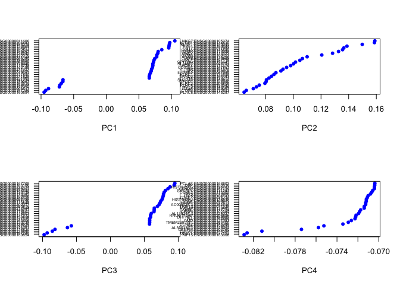

``` r
# Plot pca for both normalizatinos, since we want to put multiple plots in the same window, do.return=T was used to return the ggplot2 objec.t
p1 <- PCAPlot(object = data, dim.1 = 1, dim.2 = 2, do.return=T)
p2 <- PCAPlot(object = dataB, dim.1 = 1, dim.2 = 2, do.return=T)

# and with both color by Celltype
data <- SetAllIdent(object = data, id = "Celltype")
dataB <- SetAllIdent(object = dataB, id = "Celltype")
p3 <- PCAPlot(object = data, dim.1 = 1, dim.2 = 2, do.return=T)
p4 <- PCAPlot(object = dataB, dim.1 = 1, dim.2 = 2, do.return=T)

# plot together
grid.arrange(p1,p2,p3,p4,ncol=2)
```

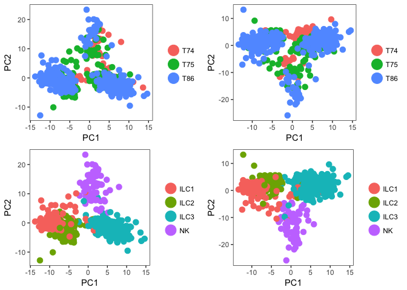

``` r
# heatmap with top loading genes
# OBS! margins too large to display in R-studio, save to pdf instead.
pdf("data/ILC/seurat_pc_loadings_heatmaps.pdf")
PCHeatmap(object = data, pc.use = 1, do.balanced = TRUE, label.columns = FALSE)
```

    ## Warning in heatmap.2(data.use, Rowv = NA, Colv = NA, trace = "none", col =
    ## col.use, : Discrepancy: Rowv is FALSE, while dendrogram is `both'. Omitting
    ## row dendogram.

    ## Warning in heatmap.2(data.use, Rowv = NA, Colv = NA, trace = "none", col
    ## = col.use, : Discrepancy: Colv is FALSE, while dendrogram is `column'.
    ## Omitting column dendogram.

    ## Warning in plot.window(...): "dimTitle" is not a graphical parameter

    ## Warning in plot.xy(xy, type, ...): "dimTitle" is not a graphical parameter

    ## Warning in title(...): "dimTitle" is not a graphical parameter

``` r
PCHeatmap(object = data, pc.use = 1:5, do.balanced = TRUE, label.columns = FALSE)
dev.off()
```

    ## quartz_off_screen 
    ##                 2

Determine statistically significant principal components
--------------------------------------------------------

If dataset is large, instead use `PCElbowPlot()`.

``` r
data <- JackStraw(object = data, num.replicate = 100, do.print = FALSE)
JackStrawPlot(object = data, PCs = 1:12)
```

    ## Warning: Removed 64217 rows containing missing values (geom_point).

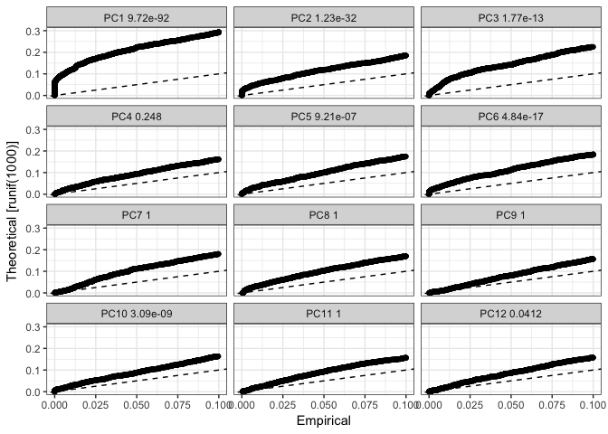

Find clusters
-------------

In this case, we use the PCs as suggested by the JackStrawPlot.

``` r
use.pcs <- c(1,2,3,5,6,10)
data <- FindClusters(object = data, reduction.type = "pca", dims.use = use.pcs, 
    resolution = 0.6, print.output = 0, save.SNN = TRUE)

PrintFindClustersParams(object = data)
```

    ## Parameters used in latest FindClusters calculation run on: 2017-09-14 14:07:35
    ## =============================================================================
    ## Resolution: 0.6
    ## -----------------------------------------------------------------------------
    ## Modularity Function    Algorithm         n.start         n.iter
    ##      1                   1                 100             10
    ## -----------------------------------------------------------------------------
    ## Reduction used          k.param          k.scale          prune.SNN
    ##      pca                 30                25              0.0667
    ## -----------------------------------------------------------------------------
    ## Dims used in calculation
    ## =============================================================================
    ## 1 2 3 5 6 10

tSNE
----

``` r
data <- RunTSNE(object = data, dims.use = use.pcs, do.fast = TRUE)

# note that you can set do.label=T to help label individual clusters
TSNEPlot(object = data,do.label = T)
```

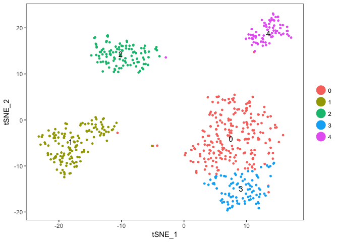 Color now automatically changes to the cluster identities.

Cluster markers
---------------

``` r
# find all genes that defines cluster1
cluster1.markers <- FindMarkers(object = data, ident.1 = 1, min.pct = 0.25)
print(x = head(x = cluster1.markers, n = 5))
```

    ##                               p_val  avg_diff pct.1 pct.2
    ## CD2:ENSG00000116824    3.715038e-98 -5.965791 0.206 0.941
    ## SCN2A:ENSG00000136531  4.929576e-88  1.224134 0.376 0.304
    ## HPGDS:ENSG00000163106  4.553357e-69  5.337017 0.638 0.014
    ## IL32:ENSG00000008517   9.349189e-65  1.372535 0.993 0.692
    ## SH2D1B:ENSG00000198574 4.306996e-56 -5.367806 0.241 0.686

``` r
# plot top cluster1 markers
VlnPlot(object = data, features.plot = rownames(cluster1.markers)[1:6],nCol=3,size.title.use=10)
```

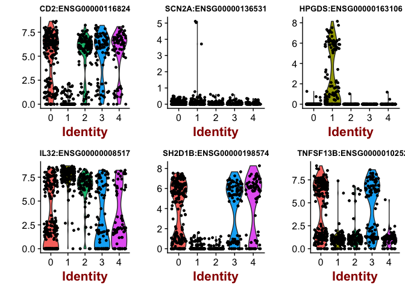

``` r
# or plot them onto tSNE
FeaturePlot(object = data, features.plot = rownames(cluster1.markers)[1:6], cols.use = c("grey", "blue"), reduction.use = "tsne")
```

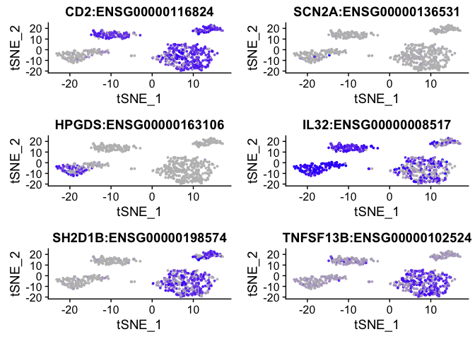

``` r
# find genes that separates cluster 0 & cluster 3
cluster03.markers <- FindMarkers(object = data, ident.1 = 0, ident.2 = 3, min.pct = 0.25)
print(x = head(x = cluster03.markers, n = 5))
```

    ##                                p_val   avg_diff pct.1 pct.2
    ## FOS:ENSG00000170345     1.093279e-48 -1.2825228 1.000 1.000
    ## DUSP1:ENSG00000120129   8.285460e-39 -0.8325728 0.996 1.000
    ## TSC22D3:ENSG00000157514 6.949058e-29 -0.7012040 0.987 1.000
    ## JUN:ENSG00000177606     1.514260e-28 -1.9805388 0.482 0.863
    ## NEGR1:ENSG00000172260   2.869291e-24  1.7378529 0.671 0.547
